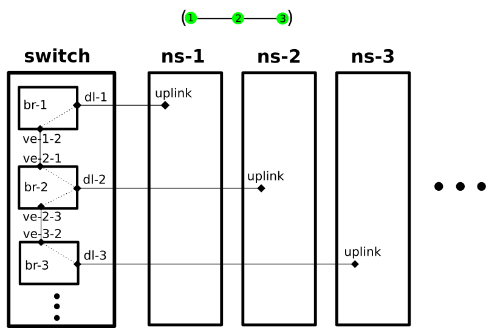

# Mesh Network Lab

Emulate mobile ad-hoc mesh networks of hundreds of nodes on a computer. The network is realized using Linux network namespaces that are connected via virtual Ethernet interfaces. The network is defined in a JSON file.

Supported is the emulation of different network characteristics like bandwidth, packet loss, latency and others using [traffic control](https://en.wikipedia.org/wiki/Tc_(Linux)). Node mobility is supported as well. The emulation can run distributed on multiple computers. It is lightweight enough to support >200 of nodes on a single desktop computer alone, and >2000 nodes if the amount of traffic is low (e.g. for reactive routing protocols).

This project is meant to test Mobile AdHoc Mesh routing protocols. Out of the box supported are [Babel](https://www.irif.fr/~jch/software/babel/), [B.A.T.M.A.N.-adv](https://www.open-mesh.org/projects/open-mesh/wiki), [OLSR1](https://github.com/OLSR/olsrd), [OLSR2](https://github.com/OLSR/OONF), [BMX6](https://github.com/bmx-routing/bmx6), [BMX7](https://github.com/bmx-routing/bmx7), [Yggdrasil](https://github.com/yggdrasil-network) and [CJDNS](https://github.com/cjdelisle/cjdns).

* [routing protocols](protocols/README.md)
* [test scenarios](tests/README.md)
* [test data sets](data/README.md)
* [test results](results/README.md)

Small example:
```
{
  "links": [
    {
      "source": "a",
      "target": "b"
    },
    {
      "source": "b",
      "target": "c"
    }
  ]
}
```

JSON keys:

- `source`, `target`: Mandatory. Name or number of the node. Maximum of 6 characters long. `source` and `target` are interchangeable and have no special distinction.
- An explicit node list can be added (e.g. `"nodes": [{"id": "a"}, {"id": "b"}]` to define node specific variables for use in combination with the `--node-command`.
- Other data fields are ignored.

## Usage

First you need to have at least one mesh routing protocol installed. For batman-adv you also need to have the batctl package installed. There is also a [script](misc/setup.sh) to install all routing protocols.

Example run:

```
# Need to run as root for local execution
# Create a 10x10 grid and write it to a file called graph.json
./topology.py grid4 10 10 > graph.json

# Create network
./network.py apply graph.json
Network setup in 10.834s:
  nodes: 100 created, 0 removed, 0 updated
  links: 180 created, 0 removed, 0 updated

# Start software
./software.py start batman-adv
Started 100 batman-adv instances in 3.16s

# Sleep to allow mesh discovery
sleep 30

# Run some test commands (output omitted)
./ping.py
./ping.py --path 0 49
./traffic.py --duration 3
./software.py --verbosity verbose run 'ip a && echo "Hello from inside node"'

# Stop software
./software.py stop batman-adv

# Remove network
./network.py apply none
```

As an alternative, you can stop all protocols using `./software.py clear` and remove all nodes (= Linux network namespaces) using `./network.py clear`. This is useful to cleanup after a tests has been interrupted.

The protocol name (e.g. `batman-adv`) refers to the start/stop scripts in the [protocols](protocols/) subfolder. Add your own scripts to support other protocols. The start script is executed once in each virtual node. The stop script is stopping all routing protocol daemons at once for convenience, while this is still a TODO, none of the current tests add/remove nodes during tests yet.

A collections of automated tests with data plot generation is available in the [tests](tests/) subfolder.

## Software Components

* `network.py` creates a network topology from a description in JSON.
* `software.py` starts routing protocol software in all namespaces.
* `topology.py` creates JSON files with descriptions of common topologies (grids, lines, loop, trees).
* `ping.py` send pings between the nodes and print statistics.
* `traffic.py` Measure the traffic that has been send between the nodes.
* `shared.py` Not callable. A collection of shared methods across this repo.

The code is written for Python 3 and uses the `ip`, `ping` and `pkill` commands. You need Linux Kernel >=4.18 to run meshnet-lab.

## Add Traffic Control

The command provided via the `--link-command` parameter of the network.py script will be executed twice. Once for every device end of a link (in the `switch` namespace). It is meant to be used to configure the kernel packet scheduler.

Given some link:
```
{
"links": [
    {"source": 0, "target": 1, "rate": "100mbit", "source_latency": 2, "target_latency": 10}
  ]
}
```

The command can now make use of the following variables:
```
./network.py \
  --link-command 'tc qdisc replace dev "{ifname}" root tbf rate {rate} burst 8192 latency {latency}ms' \
  apply graph.json
```

Notes:
- the command is called for each end of a link
- `source_` and `target_` prefixes are omitted
- `ifname` is always provided

## Distributed Execution

Emulating a lot of nodes can bring a single computer to its limits. Use `network.py --remotes <json-file> ...` to distribute the mesh network on several remotes. The SSH login as root to these computers must be passwordless.

Example remotes.json:
```
[
    {"address": "192.168.44.133"},
    {"address": "192.168.44.135"}
]
```
(Note: You can also specifiy a SSH `"identity_file"`)

A typical distributed workflow would be:
```
# create network
./network.py --remotes remotes.json apply graph.json
# start software
./software.py --remotes remotes.json start batman-adv
# run tests
./ping.py --remotes remotes.json
```

### SSH Connection Sharing

Distributed emulation uses SSH to execute commands on remote hosts.
To speed up SSH connections a lot, add this to your `~/.ssh/config`:

```
Host *
    ControlMaster auto
    ControlPath ~/.ssh/sockets/%r@%h-%p
    ControlPersist 600
```
(Note: make sure directory `~/.ssh/sockets/` exists)

## Limitations

- no support for multiple direct connections between two nodes (multigraphs)
- only one mesh interface per node/namespace
- no discrete event simulation that can run faster than real time
- computer performance might influence results

## Internal Working

Every node is represented by its own network namespace (`ns-*`) and a namespace called `switch` that contains all the cabling. The node namespace and bridge in `switch` are connected by a veth peer pair `uplink` and `dl-<node>`.

All interfaces in the bridges (except the `dl-<node>`) are set to `isolated`. This makes data flow only to and from the non-isolated `dl-<node>` interface, but not between them.

All bridges have `ageing_time` and `forward_delay` set to 0 to make them behave link a hub. A packet from the uplink will be send to all connections, but not between them.



- Applications can be started in namespaces `ns-a`, `ns-b`, `ns-c` etc. and see only their interface called `uplink`
- bridges have properties `stp_state`, `ageing_time` and `forward_delay` set to 0
- ve-* interfaces have property `isolated` set to `on`
- only one simulation can be run at the same time

## Routing Protocol Notes

- BATMAN-adv:
  - needs `batctl` installed
  - the current metric limits the maximum hop count to 32 ([source](https://lists.open-mesh.org/pipermail/b.a.t.m.a.n/2020-April/019212.html))
  - `kworker/u32:1+bat_events` quickly becomes a single threaded bottleneck
    - change `create_singlethread_workqueue()` to `create_workqueue()` in `net/batman-adv/main.c` ([source](https://lists.open-mesh.org/pipermail/b.a.t.m.a.n/2020-April/019214.html))
    - this seems to have a very little effect
  - OGM paket TTL is 50 ([source](https://git.open-mesh.org/batman-adv.git/blob/refs/heads/master:/net/batman-adv/main.h#l26))
  - tested with batman-adv 2019.4
- OLSR2 complains when the Linux kernel is not compiled with CONFIG_IPV6_MULTIPLE_TABLES enabled
  - all routes will land in the main table which can interfere with Internet access
    - this does not affect a network namespace based test setup
  - tested with olsr2 0.15.1
- OLSR1 has buggy/broken IPv6 support, we use IPv4 instead
  - tested with olsr1 0.9.8
- Babel has a maximum metric of 2^16 - 1, a single wired hop has a default metric of 96, a wireless hop with no packet loss has a metric of 256. That allows a maximum hop count of around 683 hops. ([source](https://alioth-lists.debian.net/pipermail/babel-users/2020-April/003688.html))
  - use `default rxcost 16` in the configuration file to configure the metric
- Yggdrasil needs the most resources (CPU/RAM) of the routing protocol programs supported here
  - encrypts traffic
- CJDNS security can be disabled. Compile for speed using `NSA_APPROVED=true Seccomp_NO=1 NO_TEST=1 NO_NEON=1 CFLAGS="-O0" ./do`.
- `[Errno 24] Too many open files`: With big networks, tests can spwan thousands of pings and wait for them. This can cause this error message. Use `ulimit -Sn 4096` to increase the file desciptor limit.

## Simulation Notes

To lessen the effect of the host system on the results when a lot of processes are run, it is advisable to slow down the running speed of the routing protocols (use `cpulimit` or croups) and slow down time as well ([libfaketime](https://github.com/wolfcw/libfaketime)). This has not been tried here yet!

## Related Projects

- [Shadow](https://github.com/shadow): intercepts system calls, discrete event simulation without binary modification
- [Mininet-WiFi](https://mininet-wifi.github.io/): Looks good. But because of 80211_hwsim probably slow.
- [CORE](https://github.com/coreemu/core): Common Open Research Emulator (looks good and mature, very similar to this project)
- [Ad hoc Protocol Evaluation testbed](http://apetestbed.sourceforge.net/) (old and abandened)
- [MeshGraphViewer](https://github.com/mwarning/MeshGraphViewer) can show the topology JSON files in a browser using d3.js.
- [mininet](http://mininet.org/) (uses VirtualBox images and OpenFlow, every link ends in an interface, otherwise very similar)
- [mlc](https://github.com/axn/mlc) (uses LXC Containers, supports BMX7 and Babel, very complex)
- [network-lab](https://github.com/sudomesh/network-lab) (mesh networks with network namespace, simple)
- [yggdrasil netns](https://github.com/yggdrasil-network/yggdrasil-go/blob/master/misc/run-schannel-netns) (for yggdrasil only, very simple)
- [Running Babel/OLSR/BMX7 inside kubernetes](https://media.freifunk.net/v/multipathtcp-with-un-meshed-networks-and-running-babel-olsr-bmx7-inside-kubernetes-and-containers)
- Freifunk Berlin [firmware test](https://github.com/freifunk-berlin/firmware/wiki/Local-testing) (uses docker containers)
- [100 hops IPv6 mesh](https://www.thingsquare.com/blog/articles/100-hops-ipv6-mesh/#)
