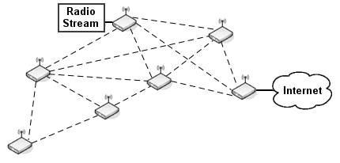
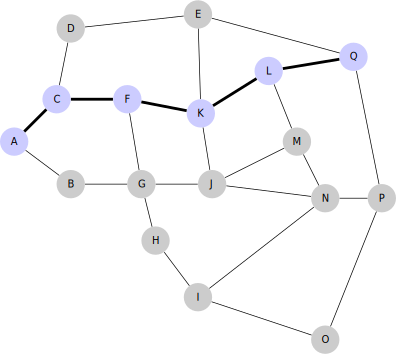

# Basics Data Set

A collection of very small but diverse set of scenarios.

## Two-Hop

```
A - B - C
```

[JSON data](two_hop.json)

## Split

```
    B
    |
A - D - C
```

[JSON data](split.json)

## Small Cross

```
    B
    |
A - E - C
    |
    D
```

[JSON data](small_cross.json)

## Big Cross

```
          B2
          |
          B1
          |
A2 - A1 - E - C1 - C2
          |
          D1
          |
          D2
```

[JSON data](big_cross.json)

## Two-Way

```
      C
     /|
A - B |
     \|
      D
```

[JSON data](two_way.json)

## Feymann S-Channel

Nodes connected in a network resembling an s-channel Feynmann diagram ([Source](https://github.com/yggdrasil-network/yggdrasil-go/blob/master/misc/run-schannel-netns)).

```
A       E
 \     /
  C - D
 /     \
B       F
```

Possible test scenario:
Bandwidth constraints are applied to D<->E and D<->F.
The idea is to make sure that bottlenecks on one link don't affect the other.

[JSON data](feymann_s_channel.json)

## Freifunk Mesh Cloud

Structure from an example found on [Wikipedia](https://commons.wikimedia.org/wiki/File:Freifunk_mesh_cloud.png).



[JSON data](freifunk_mesh_cloud.json)

## Mesh Network

Structure from an example found on [Wikipedia](https://commons.wikimedia.org/wiki/File:17_node_mesh_network.svg).



[JSON data](17_node_mesh_network.json)
