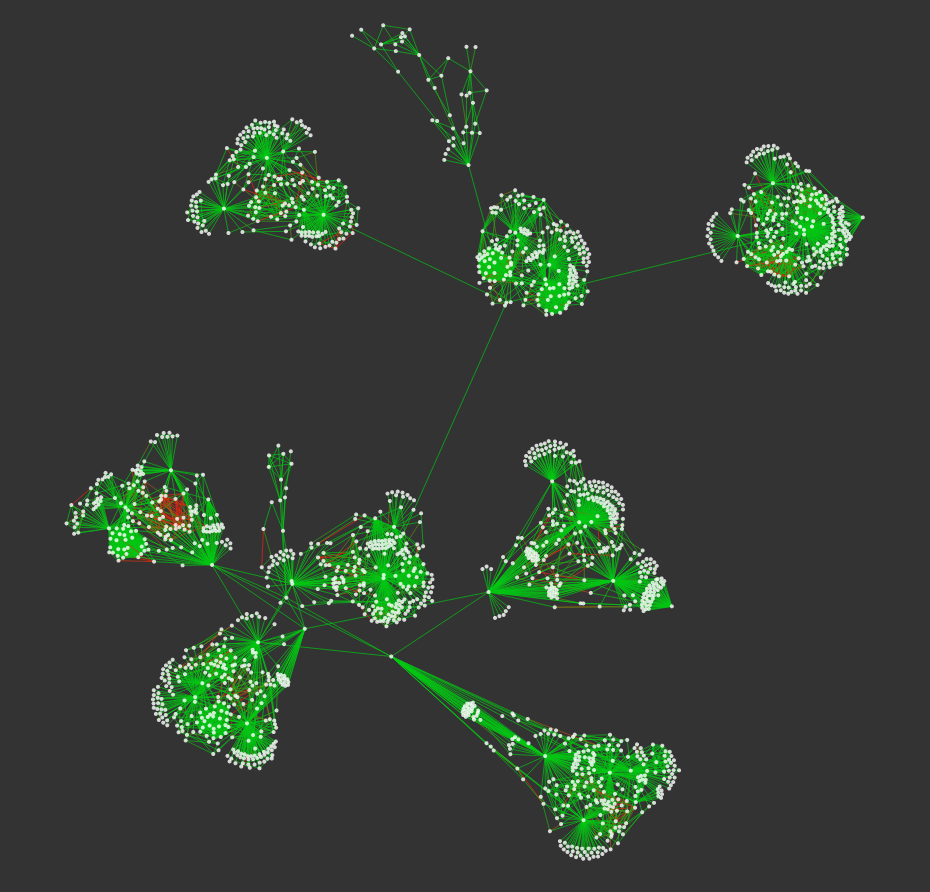
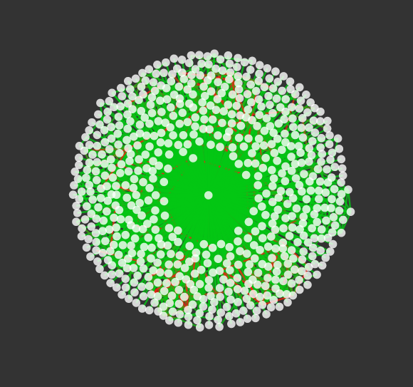
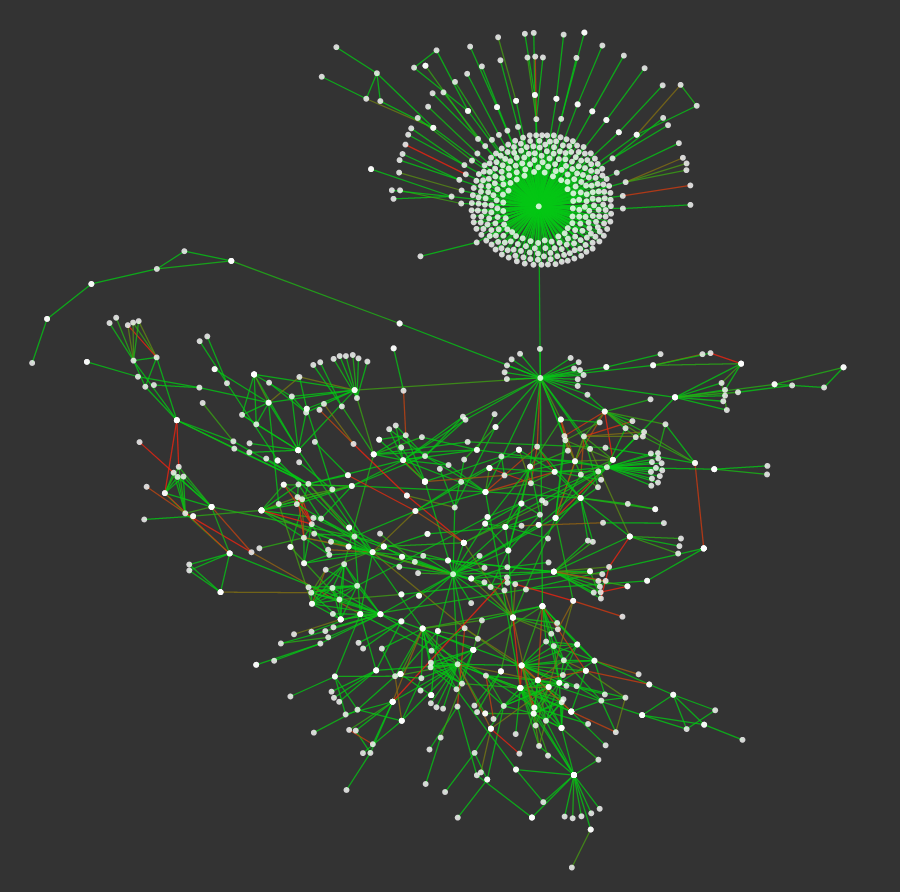
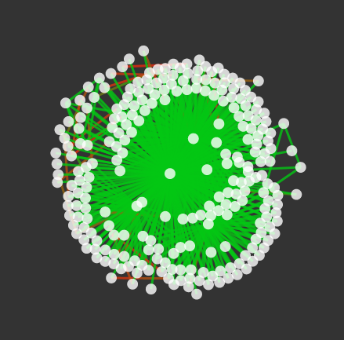
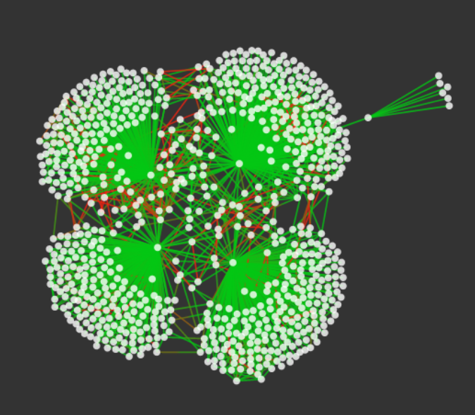
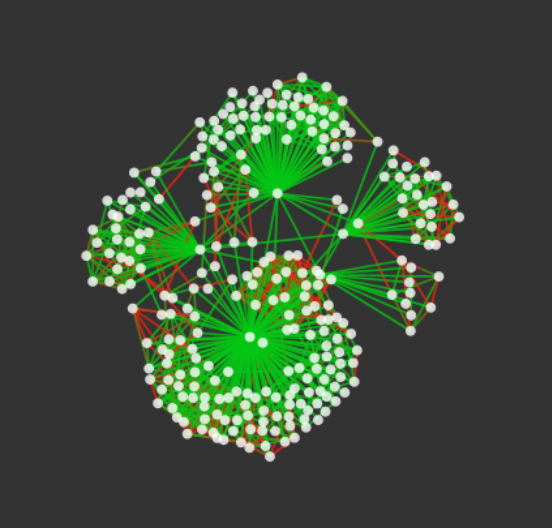
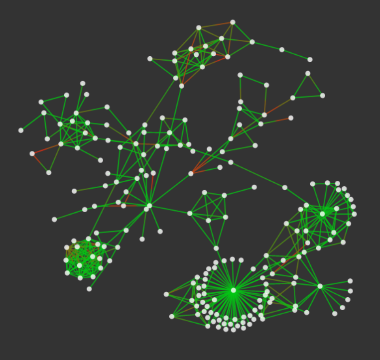
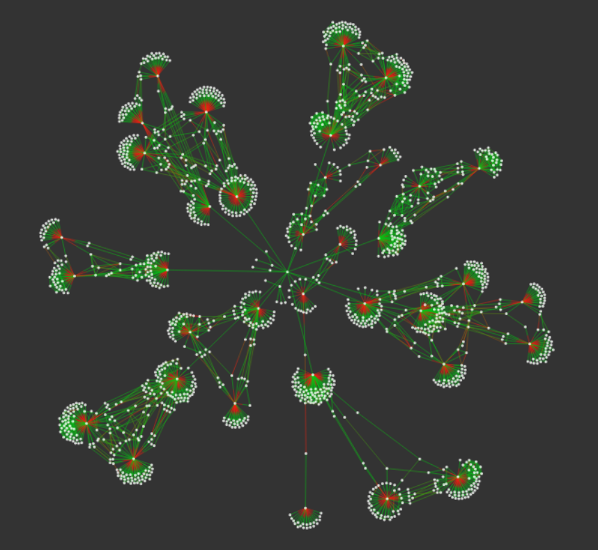
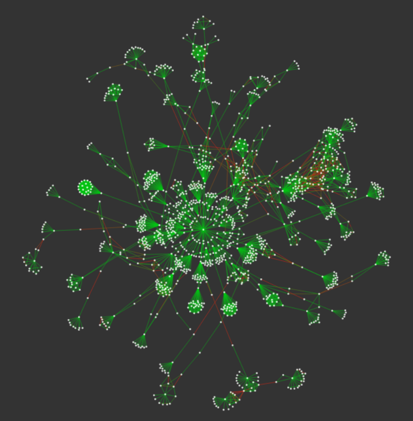
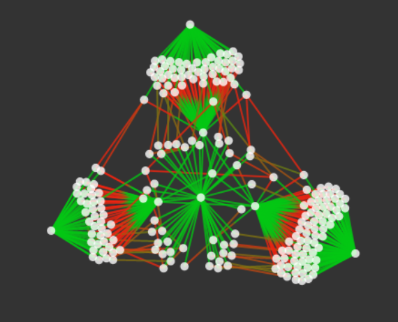

# Freifunk Data Sets

[Freifunk](https://freifunk.net) is a mesh network community in Germany with hundreds of independent communities.
This data has been downloaded from the online maps provided by the communities on their web sites. The map data has been fixed to add connections between gateways/servers that are not shown to also create connected graphs.

Most networks run batman-adv. All huge networks are also segmented, meaning that they are multiple smaller networks bound together via dedicated gateways/servers on the Internet. This is to minimize scaling overhead.

The raw data is JSON data that have been downloaded from the community site. Python scripts have been used ([1](original_freifunk_data/convert_hopglass.py), [2](original_freifunk_data/convert_hopglass.py)) to convert the raw data (Meshviewer or Hopglass format) to a processed format that can be used for testing.

The images were created using [MeshGraphViewer](https://github.com/mwarning/MeshGraphViewer). Note that highly connected graphs result in dense balls that obfuscate finer features.

## Freifunk Aachen

* [Freifunk Aachen](https://freifunk-aachen.de/)
* \~2100 nodes
* batman-adv, segmented
* [processed data](freifunk-aachen.json)
* [raw data](original_freifunk_data/freifunk-aachen-meshviewer.json)
* [data source](https://data.aachen.freifunk.net/meshviewer.json)

## Freifunk Altdorf

* [Freifunk Altdorf](https://www.freifunk-altdorf.de/)
* \~800 nodes
* batman-adv, not segmented
* [processed data](freifunk-altdorf.json)
* [raw data](original_freifunk_data/freifunk-altdorf-meshviewer.json)
* [data source](https://www.freifunk-altdorf.de/karte/)

## Freifunk Berlin

* [Freifunk Berlin](https://berlin.freifunk.net/)
* \~1000 nodes
* olsr
* [processed data](freifunk-berlin.json)
* [raw data](original_freifunk_data/freifunk-berlin-hopglass.json)
* [data source](https://berlin.freifunk.net/network/map/)

## Freifunk Bielefeld

* [Freifunk Bielefeld](https://freifunk-bielefeld.de)
* \~300 nodes
* batman-adv, not segmented
* [processed data](freifunk-bielefeld.json)
* [raw data](original_freifunk_data/freifunk-bielefeld-meshviewer.json)
* [data source](https://map.freifunk-bielefeld.de/meshviewer/data/meshviewer.json)

## Freifunk Bremen

* [Freifunk Bremen](https://bremen.freifunk.net/)
* \~800 nodes)
* batman-adv, not segmented
* [processed data](freifunk-bremen.json)
* [raw data](original_freifunk_data/freifunk-bremen-meshviewer.json)
* [data source](https://downloads.bremen.freifunk.net/data/meshviewer.json)

## Freifunk Cologne-Bonn-Area

* [Freifunk KBU](https://kbu.freifunk.net/)
* \~300 nodes
* batman-adv, segmented
* [processed data](freifunk-cologne-bonn-area.json)
* [raw data](original_freifunk_data/freifunk-cologne-bonn-area-meshviewer.json)
* [data source](https://map.kbu.freifunk.net/data/ffkbub-V2/meshviewer.json)

## Freifunk Leipzig

* [Freifunk Leipzig](http://leipzig.freifunk.net/)
* \~300 nodes
* batman-adv
* [processed data](freifunk-leipzig.json)
* [raw data](original_freifunk_data/freifunk-leipzig-meshviewer.json)
* [data source](http://karte.leipzig.freifunk.net:8018/meshviewer2/data/meshviewer.json)

## Freifunk Munich

* [Freifunk Munich](https://ffmuc.net/)
* \~1800 nodes
* batman-adv, segmented
* [processed data](freifunk-munich.json)
* [raw data](original_freifunk_data/freifunk-munich-meshviewer.json)
* [data source](https://map.ffmuc.net/data/meshviewer.json)

## Freifunk Stuttgart

* [Freifunk Stuttgart](https://freifunk-stuttgart.de)
* \~1400 nodes
* batman-adv, segmented
* [processed data](freifunk-stuttgart.json)
* [raw data](original_freifunk_data/freifunk-stuttgart-meshviewer.json)
* [data source](https://map02.freifunk-stuttgart.de/data/meshviewer.json)

## Freifunk Ulm

* [Freifunk Ulm](https://freifunk-ulm.de)
* \~200 nodes
* batman-adv, not segmented
* [processed data](freifunk-ulm.json)
* [raw data](original_freifunk_data/freifunk-ulm-meshviewer.json)
* [data source](https://map11.freifunk-ulm.de/data/meshviewer.json)

