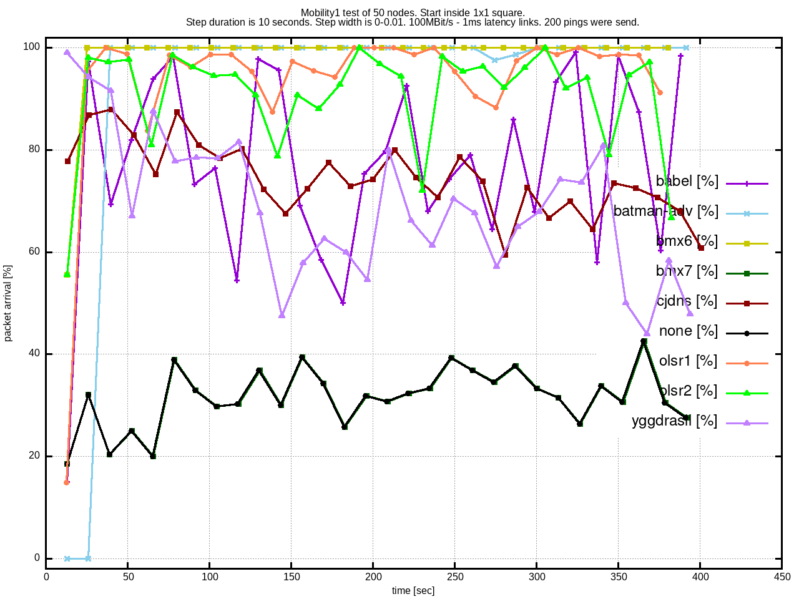
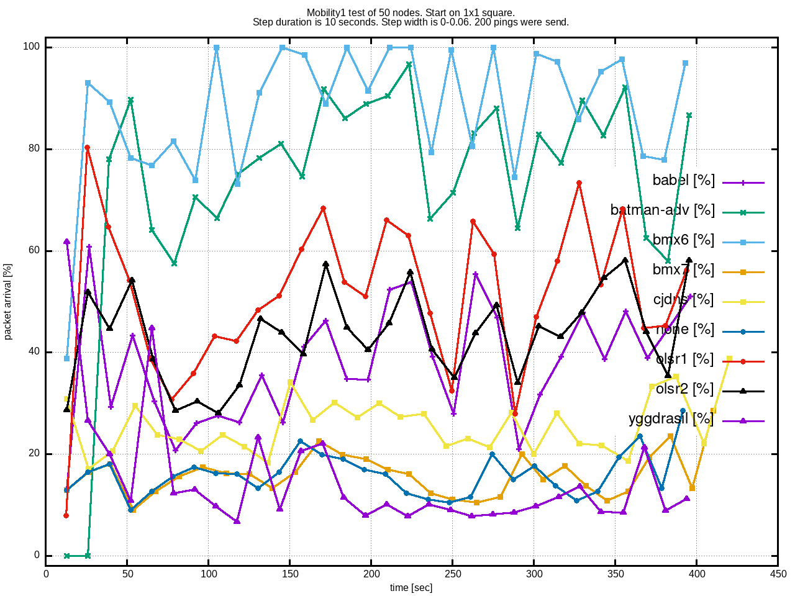
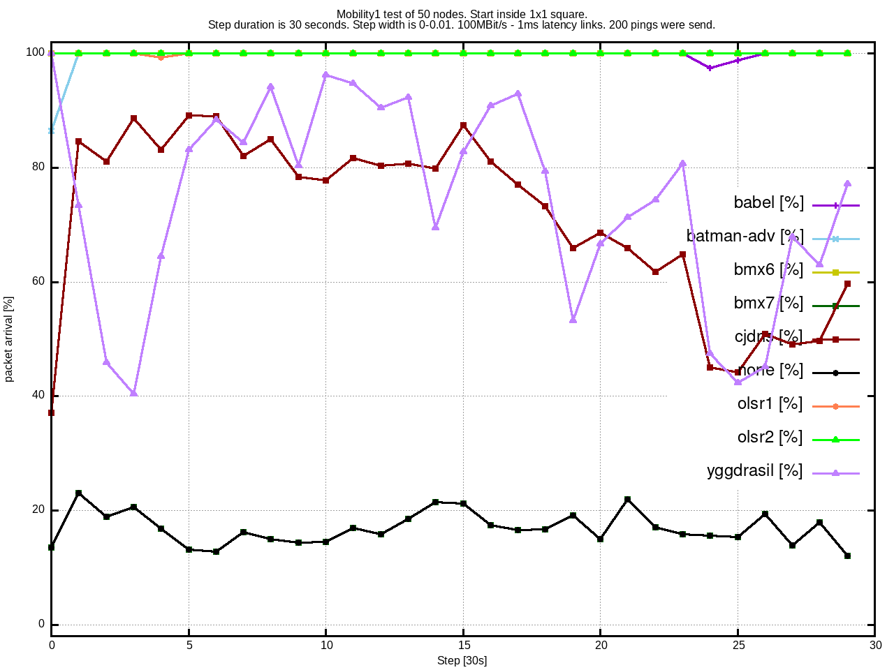
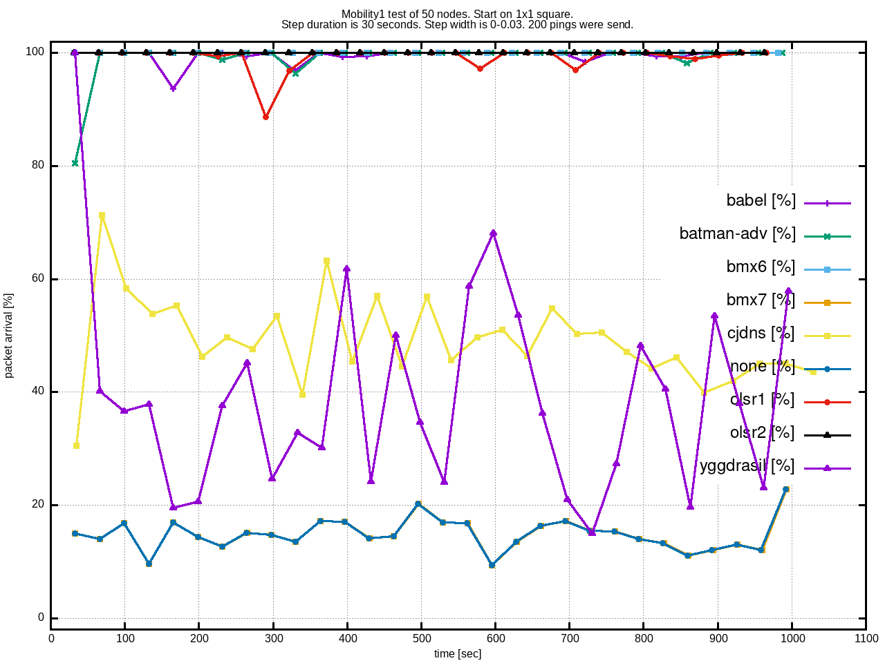
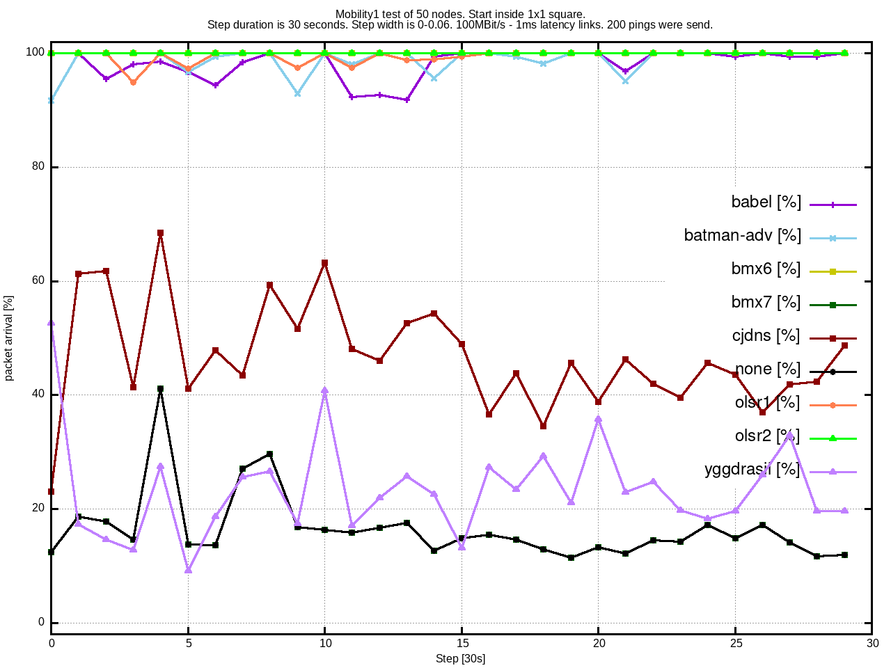
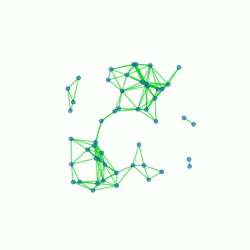
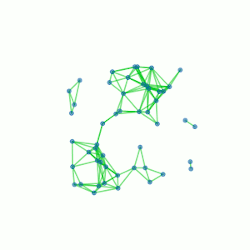
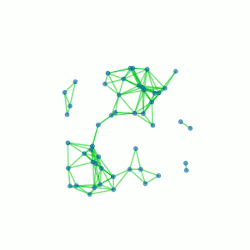

# Test Results

The results might not yet reflect real performance yet. Possible pitfalls:

* CPU usage can affect the results
* not all aspects are compared yet (e.g. mobility, packet loss)
* edge case topologies and traffic behavior (e.g. 0% packet loss)
* wrong configuration

Laptop for convergence1 and mobility1 tests:

* Void Linux (Linux 5.4.27_1 SMP PREEMPT x86_64)
* Intel i7-6500U (2 Cores, 2.50 GHz) with 8GB RAM

Server for scalability1 test:

* Debian 10.3 (Linux Kernel 4.19.0-8-amd64)
* 2 x Intel Xeon X5687 (2 * 4 Cores, 3.86 GHz) with 32GB RAM

Routing Software:

* yggdrasil (0.3.14)
* batman-adv/batctl (2020.0)
* babel (1.8.3-1)
* olsr1 (0.9.8), IPv4 tested!
* olsr2 (v0.15.1-96-g8397c64e)
* bmx6 (v1.0 / 12.05.2018 / d8869ec69797)
* bmx7 (v7.1.1 / 21.07.2019 / 91d6651ccb5a)
* cjdns (v20.5)
* `none` only works for one hop destinations. It serves as baseline.

## Topologies

An overview of the tested topologies can be found [here](../data/README.md).

## Benchmark1 Test

A test to figure out how many nodes the host system can enumlate.

Notes:

- max. 140 nodes for the laptop
- max. 220 nodes for the server

## Convergence1 Test

Notes:

- the line topology is the biggest challenge here
- the timing intervals are visible
- batman-adv can not reach 100% on a line, since the maximum hop count is 32
- cjdns struggles a bit, at about 30 seconds there seem to be a reconfiguration
- yggdrasil has the best start performance
- bmx7 does not route any packets except if it goes to a direct neighbor, the reasons are unknown
- these three graphs take about 8 hours to generate

## Mobility1 Test

  

Notes:

- Test setup:
  1. 50 nodes are distributed on a 1km x 1km square
  2. 150 nearest links are established
  3. after 10/30 seconds, 200 pings are send from a random source node to random destination node
  4. all nodes now move 0-10/30/60m in a random direction
  5. continue at step 2
- some pings cannot reach the destination, so 100% is only based on the actual possible limit (no duplicates or reverse paths are choosen)
- the higher a line, the better
- bmx7 is at the baseline, because in this test it does not do routing
- yggdrasil uses a dedicated tun0 interface, as such, in can perform below the one hop baseline

## Scalability1 Test

Notes:

- a low packet arrival rate makes the corresponding traffic result data meaningless (e.g. the complete line data :/)
- some routing protocols cause a huge amount of traffic that is not seen in reality:
  - yggdrasil on a grid4 and line
  - batman-adv on grid4 and rtree
- batman-adv has a maximum hop limit of 32
- grid4 and line topologies are pathological
- the data for each graph takes 18 hours to generate

## Connectivity1 Test

This is a pure numerical test of the percolation theory. Nodes are distributed randomly in an area and given increasing range. The connectivity (% of possible connections) is measured.

Notes:

- this is called Gilbert's random disk model
- the connectivity rises exponentionally
- the standard deviation decreases very quickly near 100%
- further reading: [Insights From Percolation Theory](https://inthemesh.com/archive/from-mocha-to-mesh-insights-from-percolation-theory/)
