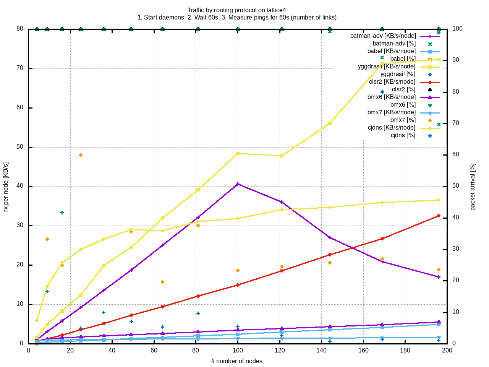
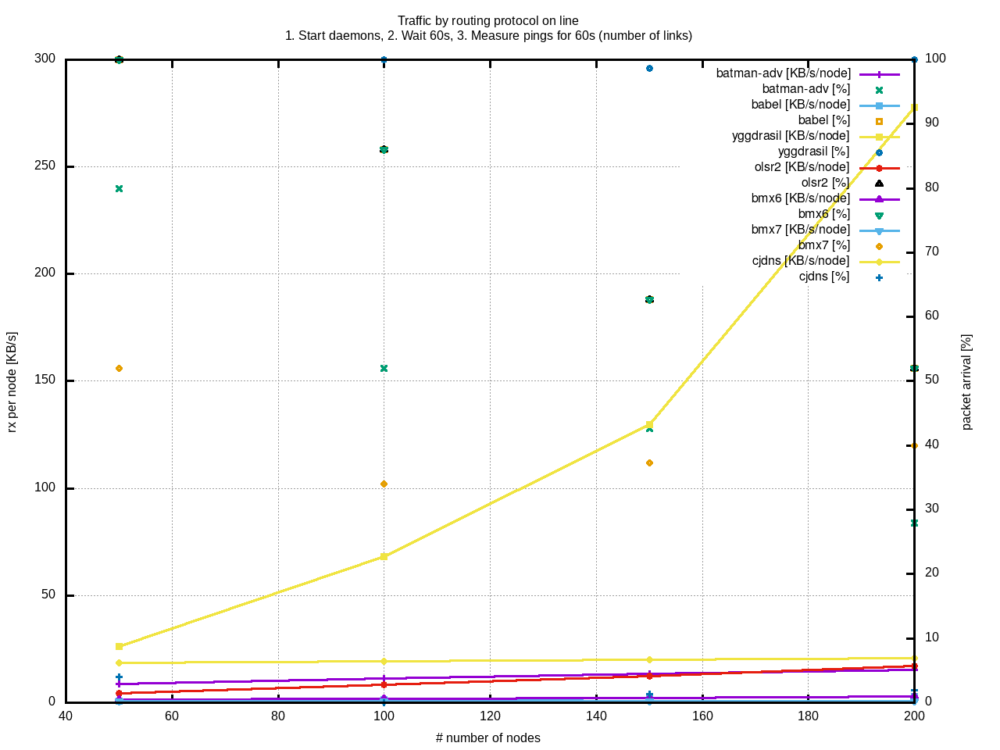
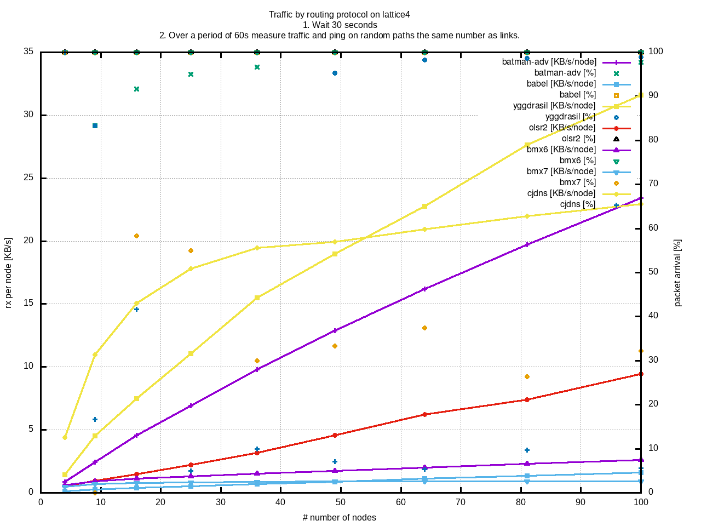
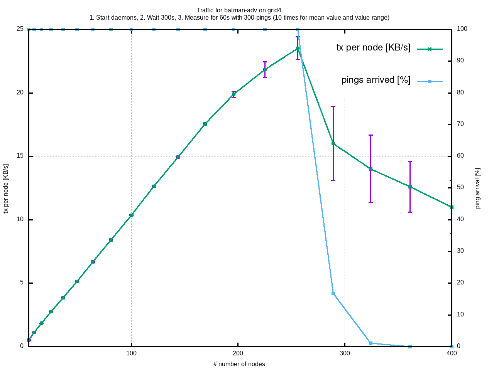

# Test Results

The results might not yet reflect real performance yet. Possible pitfalls:

* CPU usage can affect the results
* not all aspects are compared yet (e.g. mobility, packet loss)
* edge case topologies and traffic behavior (e.g. 0% packet loss)

## Hardware

Server:

* Debian 10.3 (Linux Kernel 4.19.0-8-amd64)
* 2 x Intel Xeon X5687 (2 * 4 Cores, 3.86 GHz) with 32GB RAM

Laptop:

* Void Linux (Linux 5.4.27_1 SMP PREEMPT x86_64)
* Intel i7-6500U (2 Cores, 2.50 GHz) with 8GB RAM

Routing Software:

* yggdrasil (0.3.14)
* batman-adv/batctl (2020.0)
* babel (1.8.3-1)
* olsr1 (0.9.8), IPv4 tested!
* olsr2 (v0.15.1-96-g8397c64e)
* bmx6 (v1.0 / 12.05.2018 / d8869ec69797)
* bmx7 (v7.1.1 / 21.07.2019 / 91d6651ccb5a)
* cjdns (v20.5)

## Convergence1 Test

## Traffic1 Test

### Server / Grid4

### Server / Line

### Server / RTree

### Laptop / Grid4

Note that the packet arrival rates are usually pretty bad. This is probably because the software is measured directly after start. Let's wait 30 seconds:

bmx7 and cjdns show a very low arrival rate (high packet loss), so their graphs should be ignored. The worst performer seems to be batman-adv here. But the traffic usage is not what is seen in reality. Maybe it is because of the grid structure and lack of packet loss. Further investigations are needed.

Let's wait for 60 seconds until starting the test.

No big change for batman-adv here.

## Traffic2 Test

### Laptop Grid4

With a single threaded `bat_events` events queue:

The dropping packet arrival rate after 100 nodes might indicate that the system has come to its limits.
For many nodes, "kworker/u32:1+bat_events" is at 100% for a long time.

### Server Grid4

With a single threaded `bat_events` events queue:

For many nodes, "kworker/u32:1+bat_events" is at 100% for a long time.

With a multithreaded `bat_events` events queue:

