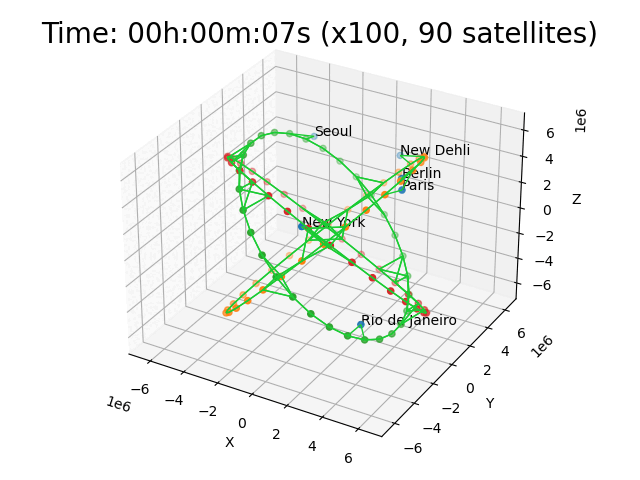

# Satellites 1

Test a mobile topology with satellites, ground stations and gound clients. The setup is inspired by [Starlink](https://www.starlink.com/) setup operated by [SpaceX](https://www.spacex.com/). The amount of those in this particular test is very low. The animation does not show live data from the simulation, but shows the movements in the test (at a different speed).

## Test

1. create nodes for ground stations (Paris, Berlin, New York, Seoul, New Dehli, Rio de Janeiro)
2. create nodes for 3 orbits with 30 satellites each
3. select 20 random paths between ground stations
4. connect all nodes in reach (2000km)
    * ground stations connect to 2 satellites at most
    * satellites to at most 8 other satellites
5. move satellites and earth in 24 steps (2 hours of movement in reality)
6. send ping on each random path
7. record ping statistics and traffic
8. continue at 1.

## Run Animation

To run the animation as depicted above, modify `run.py` script and comment in the `start_animation()` call. Then execute the script. Use the left mouse button to rotate, right mouse button to zoom in or out. There is also a line to write the output to a file.

## Run Test

* remove remaining `*.csv` files in this directory
* execute `sudo ./run.py` to run the test (will take a long time).
* `./plot.sh` will create graphs using gnuplot
