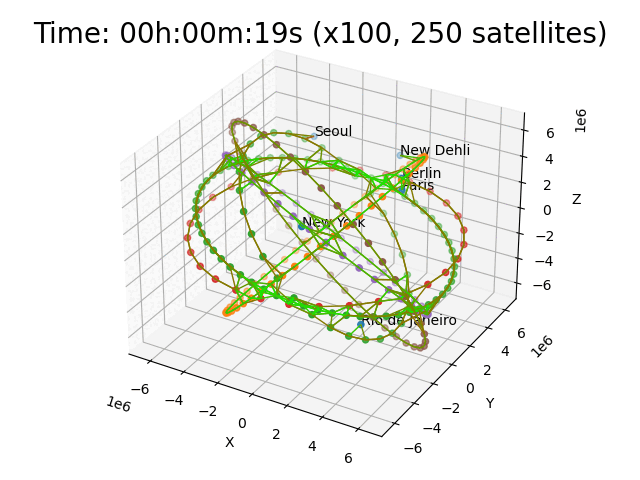

# Satellites 2

Test a mobile topology with satellites, ground stations and gound clients. Similar to the [Satellites1](../satellites1/) test.
The animation does not show live data from the simulation, but shows the movements in the test (at a different speed).

## Run Animation

To run the animation as depicted above, modify `run.py` script and comment in the `start_animation()` call. Then execute the script. Use the left mouse button to rotate, right mouse button to zoom in or out. There is also a line to write the output to a file.

## Run Test

* remove remaining `*.csv` files in this directory
* execute `sudo ./run.py` to run the test (will take a long time).
* `./plot.sh` will create graphs using gnuplot
