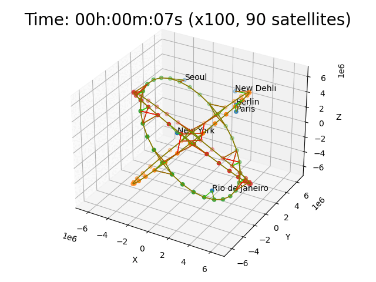

# Satellites 3

Like [satellite1](../satellites1/) test, but with packet loss of 0-10% per link and a delay dependent of it's virtual length.
The links are also limited to 20MBit/s. This tests also runs in real time (2 hours for each protocol).

## Run Animation

To run the animation as depicted above, modify `run.py` script and comment in the `start_animation()` call. Then execute the script. Use the left mouse button to rotate, right mouse button to zoom in or out. There is also a line to write the output to a file.

## Run Test

* remove remaining `*.csv` files in this directory
* execute `sudo ./run.py` to run the test (will take a long time).
* `./plot.sh` will create graphs using gnuplot
