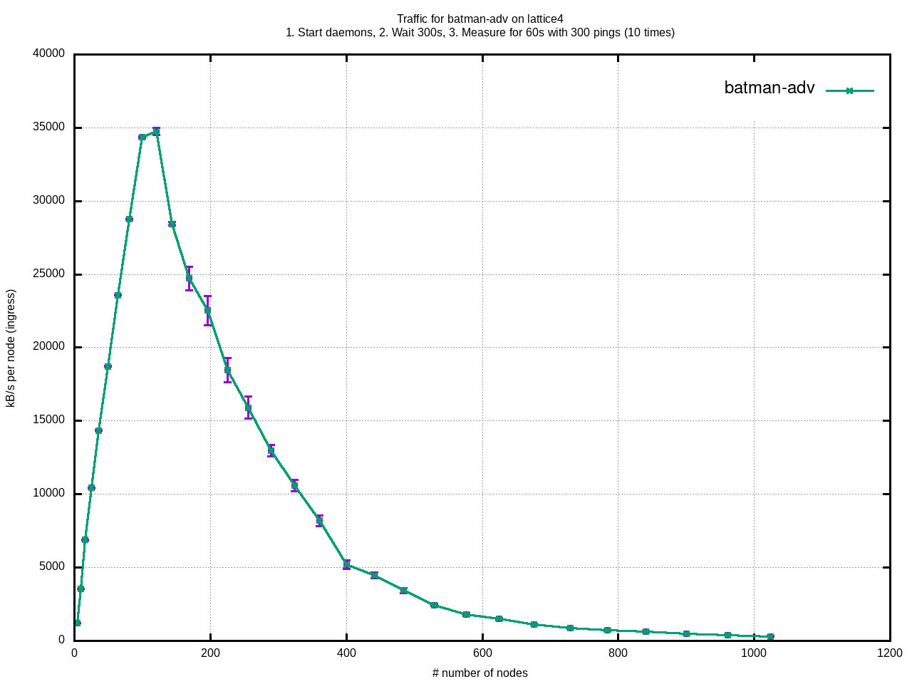

# Traffic Test 2

The mesh routing program batman-adv is tested on lattice structures of different sizes.
Test platfom is a i7-6500U CPU @ 2.50GHz (2 cores) with 8 GB RAM.
Every test was performed 10 times to calculate the standard deviation (error bars).

## Result

## Run

* remove remaining `*.csv` files in this directory
* execute `sudo ./run.sh` to run the test (will take a long time).
* `./plot.sh` will create graphs using gnuplot
